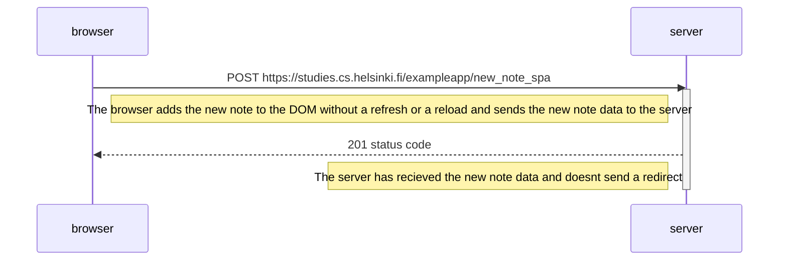

```mermaid
    sequenceDiagram
    participant browser
    participant server

    browser->>server: POST https://studies.cs.helsinki.fi/exampleapp/new_note_spa
    activate server
    Note right of browser: The browser adds the new note to the DOM without a refresh or a reload and sends the new note data to the server
    server-->>browser: 201 status code
    Note left of server: The server has recieved the new note data and doesnt send a redirect
    deactivate server
```